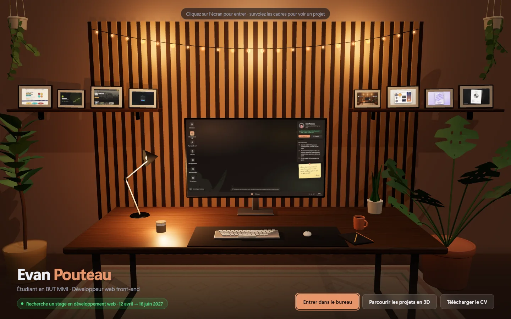
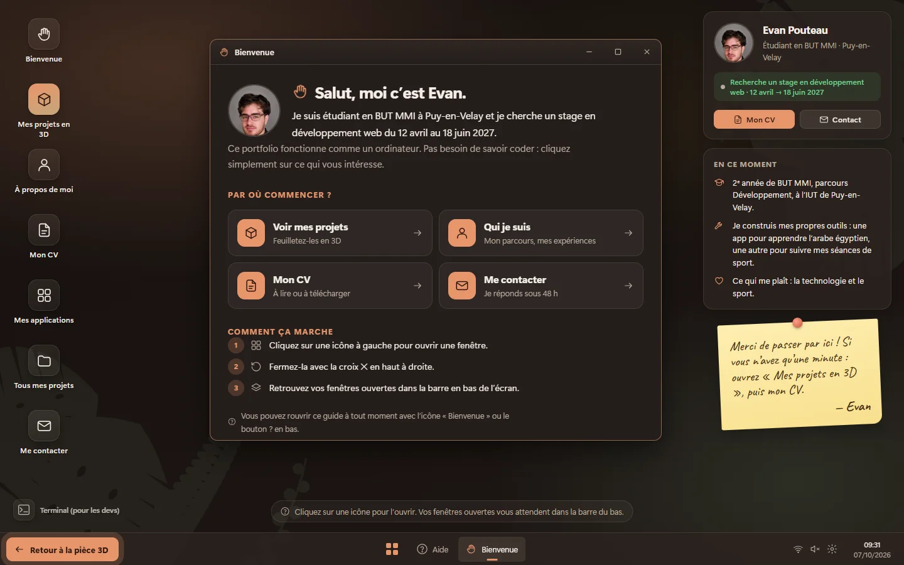
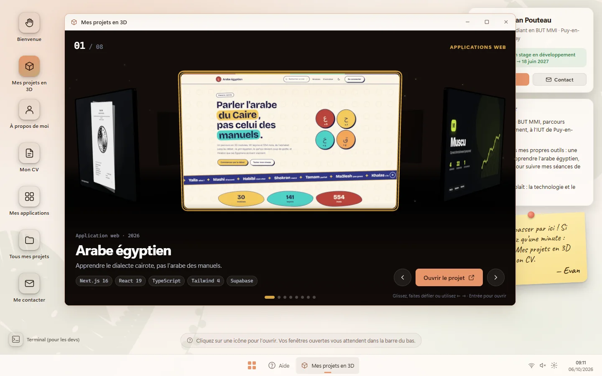
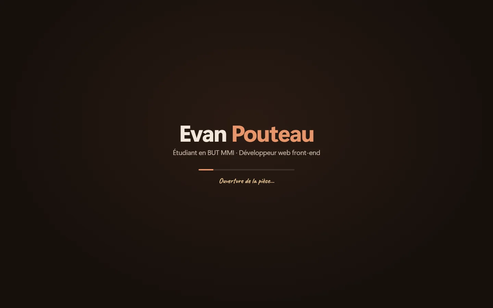
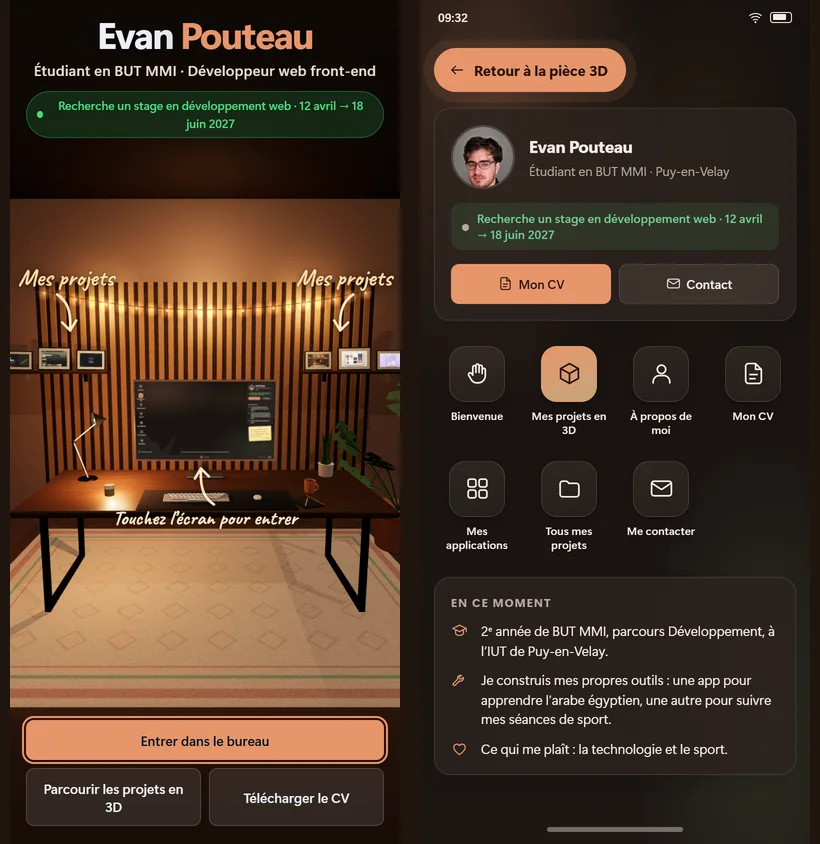

# EvanOS — portfolio d'Evan Pouteau

Un portfolio qui se visite comme un bureau. On arrive dans une pièce en 3D,
la caméra plonge dans l'écran de l'ordinateur, et l'on se retrouve sur un
système d'exploitation : on y ouvre des fenêtres pour parcourir mes projets,
mon parcours et mon CV.

**[evanpouteau.vercel.app](https://evanpouteau.vercel.app)**



Étudiant en 2ᵉ année de BUT MMI (parcours Développement) à l'IUT Clermont
Auvergne, je cherche un **stage en développement web du 12 avril au
18 juin 2027**. [LinkedIn](https://www.linkedin.com/in/evan-pouteau-06a9a7342)

## Ce qu'on y trouve

| | |
|---|---|
|  |  |
| **Un bureau lisible par tous** : une fenêtre de bienvenue explique où cliquer, pas besoin de connaître la métaphore Windows ; un bouton ramène à la pièce 3D à tout moment. | **Une galerie 3D** : les projets défilent dans un carrousel, au clavier, à la souris ou au doigt. |
|  |  |
| **Un écran de chargement** qui suit l'avancement réel de la pièce, pour qu'on ne croie jamais le site vide. | **Pensé pour le téléphone** : annotations replacées, fenêtres plein écran, aide adaptée au tactile. |

- **Huit projets**, dont deux applications Next.js + Supabase en production :
  une app pour apprendre l'arabe égyptien et une app de suivi de musculation.
- **Un vrai gestionnaire de fenêtres** : déplacer, redimensionner, aimanter
  aux bords, Alt+Tab, menu Démarrer avec recherche, thème clair ou sombre,
  français ou anglais.
- **Un terminal** pour les curieux (`help`, `projets`, `open muscu`…).
- **Une page classique par projet** (`/projets/<nom>`), lisible sans 3D et
  référencée par les moteurs de recherche.
- **Accessible** : la 3D se saute d'une touche, et elle n'est pas chargée du
  tout si le système demande moins d'animations ou ne gère pas WebGL.

## Comment ce projet a été réalisé

**Ma part.** Le concept (un portfolio qui se visite comme un bureau), la
direction artistique (la pièce chaleureuse, les plantes, la lumière tamisée),
les contenus et les choix d'ergonomie sont les miens. J'ai fait tester le site
à mes professeurs et intégré leurs retours (écran de chargement, nom mis en
avant, repères dans la pièce, bouton de retour), repéré et fait corriger les
problèmes de la version téléphone, et je gère le déploiement (GitHub → Vercel).
La première version de ce portfolio, un site statique, est dans
[`legacy/`](legacy/).

**Avec une IA.** Cette version Next.js + Three.js a été développée avec
Claude, un assistant de code, que j'ai dirigé : je décris ce que je veux, je
teste, je refuse ou je fais reprendre ce qui ne va pas. Les mécanismes les plus
pointus, comme la compilation des shaders en arrière-plan ou l'éclairage
d'environnement, sont issus de ce travail, et je les documente ci-dessous.
Savoir mener un projet réel de bout en bout avec ces outils fait partie des
compétences que je veux montrer.

## Stack

- **Next.js 16** (App Router, pages statiques) · **React 19** · **TypeScript**
- **Three.js** avec **React Three Fiber** et **drei**
- **Tailwind CSS 4** · polices auto-hébergées · déploiement sur **Vercel**

Toute la pièce est générée par du code : meubles, plantes, guirlande et
matières (bois, feutre, tapis) sont construits dans le navigateur, sans aucun
modèle 3D importé.

## Quelques choix techniques

- **Shaders compilés avant la première image.** Au premier affichage, la
  carte graphique compilait 53 shaders en bloquant la page jusqu'à 5 s. Ils
  sont désormais compilés en parallèle (`compileAsync`) pendant que la page
  reste utilisable, puis la pièce apparaît en fondu. Résultat mesuré sur un
  premier chargement : la pièce est visible en 1,8 s au lieu de 4,5 s, et la
  page ne gèle plus ([`warmup.tsx`](components/three/warmup.tsx)).
- **Ombres figées après le chargement.** Rien ne bouge vraiment dans la
  pièce : les ombres sont calculées une fois puis gelées. La scène tient
  60 images par seconde sur une carte graphique intégrée.
- **Éclairage d'environnement fait maison**
  ([`studio-env.tsx`](components/three/studio-env.tsx)) plutôt que celui de
  drei, qui embarquait environ 100 Ko de chargeurs d'images HDR inutiles.
- **Étiquettes 3D en HTML ordinaire**, projetées à chaque image
  ([`projected-labels.tsx`](components/three/projected-labels.tsx)) : le
  composant `<Html>` de drei plantait sous React 19.
- **Une seule source de contenu** : chaque projet est décrit une fois dans
  [`content/projects.ts`](content/projects.ts), et l'étagère, le carrousel,
  l'explorateur, le terminal et les pages publiques s'en nourrissent.

## Lancer le projet

```bash
npm install
npm run dev        # http://localhost:3000
npm run build      # build de production
npm run lint       # vérification des types
```

## Organisation

```
app/              Pages : accueil, /projets/<nom>, mentions légales, sitemap
content/          Les projets et le profil (formation, expériences, compétences)
components/
  home.tsx        Passage de la scène 3D au bureau
  os/             Le système : fenêtres, barre des tâches, terminal, galerie
  three/          Les scènes 3D : pièce, étagères, carrousel, matières
public/assets/    Couvertures, captures, CV
tools/            Scripts de génération (fond d'écran, CV)
legacy/           L'ancienne version statique du portfolio, gardée pour mémoire
```

Les notes pour faire évoluer le site (ajouter un projet, déployer, pièges à
éviter) sont dans [`docs/MAINTENANCE.md`](docs/MAINTENANCE.md).
